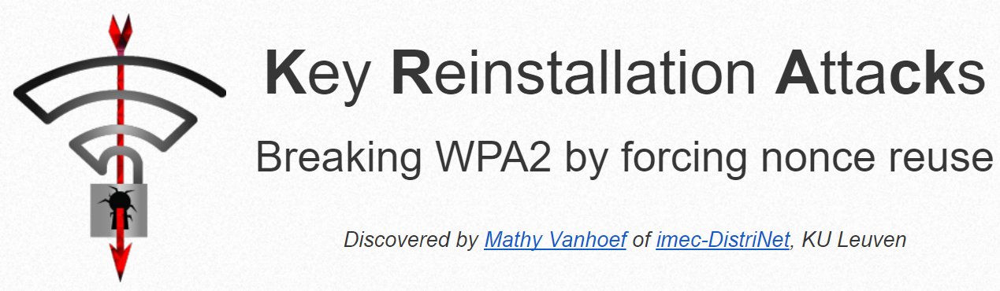

# KRACK Attack

<div align="center">
    <p>
        
    </p>
    <div>
        
        
    </div>
</div>

## Table of contents

-   [Introduction](#introduction)
-   [Installation](#installation)
-   [Getting Started](#getting-started)
    -   [Lab 0](#lab-0)
    -   [Lab 1](#lab-1)
    -   [Lab 2](#lab-2)
    -   [Lab 3](#lab-3)
-   [Contacts](#contacts)

# Introduction

# Installation

This repository is intended to be already set up within the Virtual Machines provided for the Network Security course of the University of Trento. However, if this is not the case for you, you can follow these instructions to set up your own Virtual Machine.

1. Download and Install [Lubuntu 16.04.*](https://cdimage.ubuntu.com/lubuntu/releases/16.04/release/) using [VirtualBox](https://www.virtualbox.org/wiki/Downloads).

> [!IMPORTANT]
> Please note that the following commands are meant to be used inside the Virtual Machine

2. Install `git`:
   
   ```bash
    sudo apt-get install -y git
    ```

> [!NOTE]
> If you get this error: `* is not in the sudoers file` run `su root -c 'echo "YOUR_USERNAME ALL=(ALL:ALL) ALL" >> /etc/sudoers'`

3. Clone this repo with its submodules:
   
   ```bash
    git clone --recurse-submodules https://github.com/christiansassi/network-security-lab
    ```
5. Then, inside the repo folder run the `vm_setup.sh`:
   
   ```bash
    cd network-security-lab
    ./vm_setup.sh
    ```

# Getting started

## Lab 0

## Lab 1

## Lab 2

## Lab 3

# Contacts

Matteo Beltrami - [matteo.beltrami-1@studenti.unitn.it](mailto:pietro.bologna@studenti.unitn.it)

Luca Pedercini - [luca.pedercini@studenti.unitn.it](mailto:luca.pedercini@studenti.unitn.it)

Christian Sassi - [christian.sassi@studenti.unitn.it](mailto:christian.sassi@studenti.unitn.it)

<a href="https://www.unitn.it/"></a>
